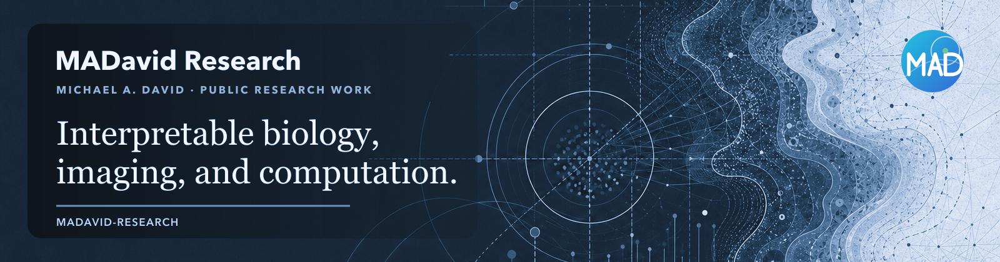

  

# MADavid Research

MADavid Research is a collaborative research organization led by **Michael A. David** and built with colleagues and research collaborators.

Together, we connect biology, imaging, machine learning, and high-throughput data analytics to make complex evidence more interpretable and useful.

## What we work on

- Spatial histopathology and tissue biology
- Medical imaging, radiomics, and multimodal measurement
- Multi-omics and high-throughput data analysis
- Interpretable machine learning
- Reproducible research software and scientific communication

## Explore the work

- [MADavid Research on GitHub](https://github.com/madavid-research)
- [Research and publications](https://michaeladavid.com/research)
- [Research programs](https://michaeladavid.com/projects)
- [Public software](https://michaeladavid.com/software)
- [Scientific art and visual work](https://michaeladavid.com/art)
- [MADavid Research website](https://michaeladavid.com)

## Working principles

**Interpretable methods. Reusable tools. Better questions.**

Our public projects are documented with their purpose, evidence, limitations, and routes for reuse wherever possible.

## Connect

For research collaboration, speaking, mentorship, software, or visual-work inquiries, visit the [contact page](https://michaeladavid.com/contact).

  © Michael A. David · MADavid Research

